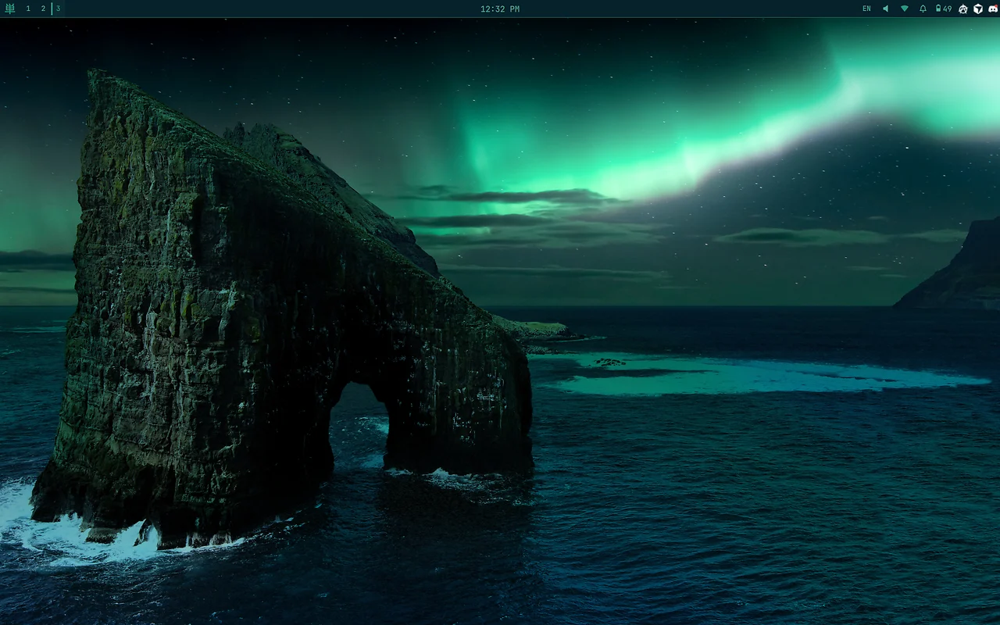
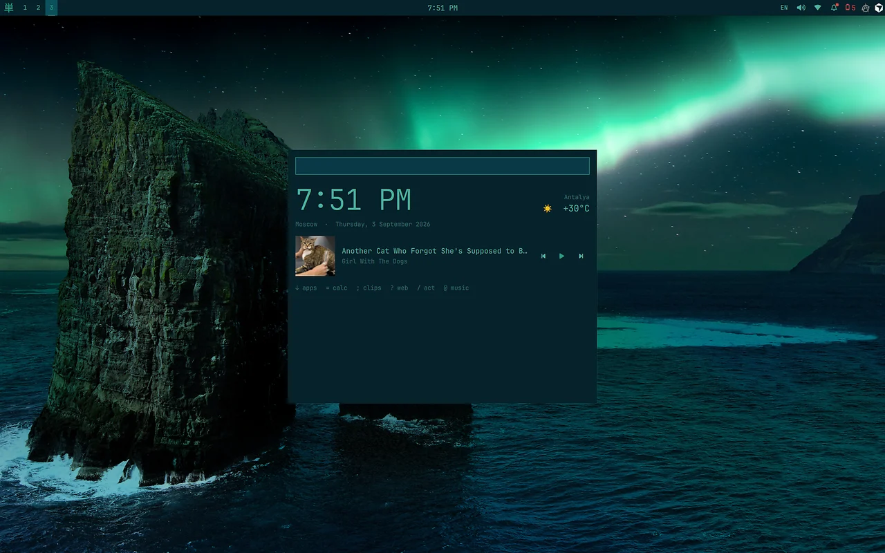
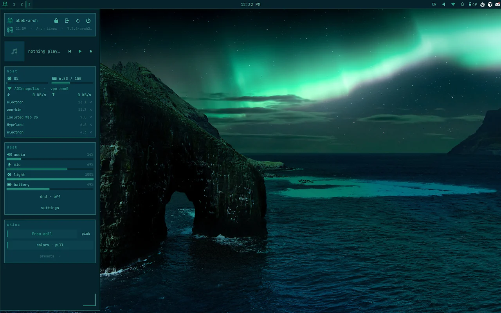
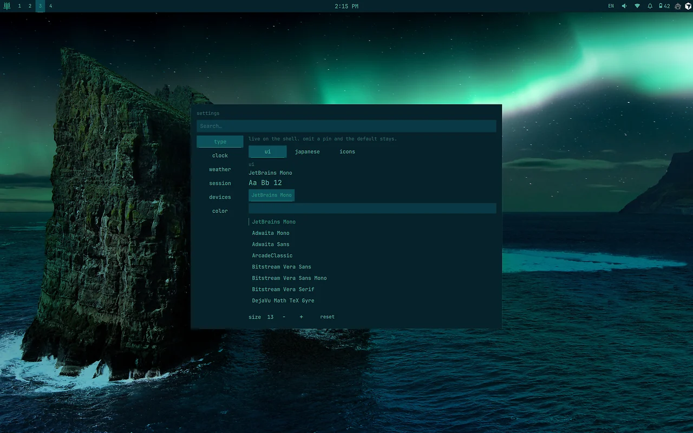
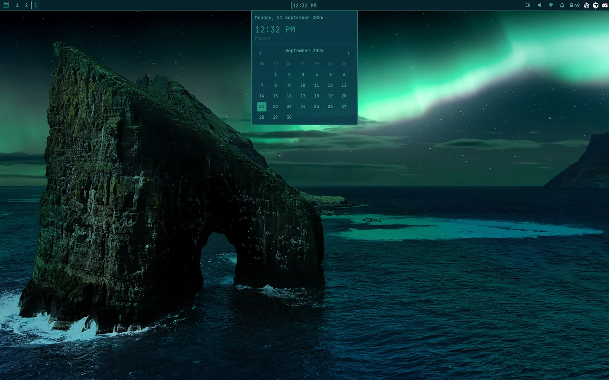

<div align="center">

**単 Tanjun**

単純 — simple in structure, unmixed.

One [Quickshell](https://quickshell.outfoxxed.me) process. Hyprland or niri; the shell does not care.

### **[▶ Demo](docs/demo.mp4)  -  [What you get](#what-you-get)  -  [Keys](#keys)  -  [Install](#install)  -  [Manual](#manual)**

</div>

<p align="center">
  <a href="docs/demo.mp4">
    
  </a>
  <br>
  <a href="docs/demo.mp4"><strong>▶ Watch the demo</strong></a>
  &nbsp;·&nbsp; 54s · mp4
</p>

| | |
|---|---|
|  |  |
|  |  |

## What you get

- **Quiet bar** — 単, desks, clock, a few glyphs. Click opens a panel, not a terminal.
- **Launcher** — rest card (clock, weather, track) until you type. Prefixes: `=` calc, `:` emoji, `/` wallpaper.
- **Overview** — live window previews. Super+Tab on Hyprland, Super+Grave on niri.
- **System drawer** — per-stream mixer, Bluetooth, Wi-Fi, VPN, host meters, power, skins.
- **Settings** — rail, live JSON pins, font picker, search. Super+,
- **Color** — named skins, From wall, or pull colors from a paper. Keep the palette so a new wall cannot jump the rice.
- **Idle and lock** — dim, lock, DPMS, sleep in-shell. Fingerprint if PAM has it. Super+L.
- **Wallpaper** — still or video. Lock uses a still frame.

## Keys

Compositor binds come from `scripts/setup.sh`. Left click on a bar glyph opens its panel.

| Keybind | Action |
|---------|--------|
| `Super + A` | Launcher |
| `Super + Tab` | Overview (Hyprland) |
| `Super + Grave` | Overview (niri) |
| `Super + 1, 2, 3…` | Desk |
| `Super + Q` | kitty |
| `Super + E` | yazi (float 70%) |
| `Super + V` | Clipboard |
| `Super + C` | Close window |
| `Super + R` | Toggle float |
| `Super + B` | Pair buds |
| `Super + L` | Lock |
| `Super + O` | Logout |
| `Super + ,` | Settings |
| `Super + Space` | Keyboard layout |
| `Super + arrows` | Focus |
| `Super + Shift + arrows` | Resize |
| `Print` | Region screenshot |
| `Super + Print` | Window screenshot |
| `Alt + Print` | Active-output screenshot |

Summon without aiming at a glyph:

```bash
qs ipc call tanjun toggleLauncher
```

All binds: [docs/keys.md](docs/keys.md).

## Install

```bash
git clone https://github.com/abeb021/Tanjun-shell.git
cd Tanjun-shell
bash scripts/setup.sh --hyprland   # or --niri
```

Needs Quickshell on `PATH`. `setup.sh` links `shell/` to `~/.config/quickshell`, writes compositor autostart and binds, and copies lock PAM to `~/.config/tanjun/pam` (mode 600). Restart the compositor, or:

```bash
quickshell -p ~/.config/quickshell
```

> [!NOTE]
> PAM under `~/.config/tanjun/pam` is trusted like sudoers. Group- or world-writable files are refused.

## Manual

1. [Install](docs/install.md) — clone, rice, PAM
2. [Keys](docs/keys.md) — binds, bar clicks, launcher prefixes
3. [Config](docs/config.md) — JSON, color pick, style, wallpaper
4. [IPC](docs/ipc.md) — `qs ipc` verbs

Pins live in `~/.config/tanjun/config.json`. Copy [config.example.json](config.example.json) to start; omit a key and the default stays.

Widgets talk to `Compositor` only. Hyprland and niri each implement that contract.

```
shell/                  one Quickshell process
compositors/hyprland/   Lua rice
compositors/niri/       KDL rice
scripts/setup.sh        link, autostart, binds, PAM
tests/                  bash tests/run.sh
```

---

v3.5
